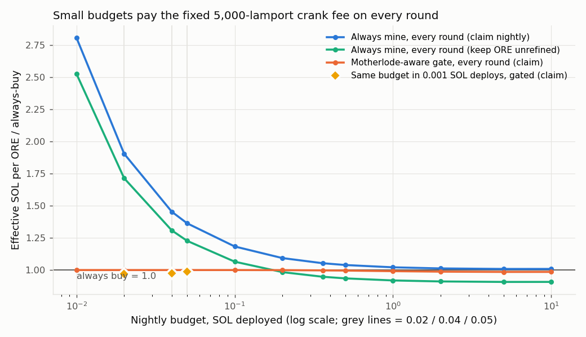
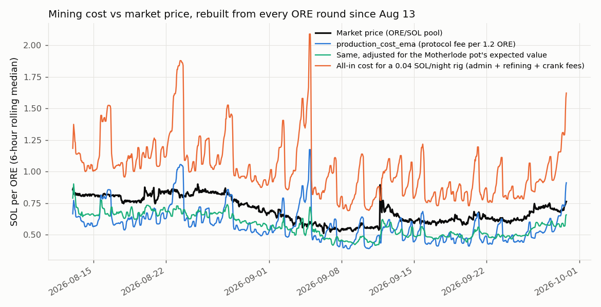
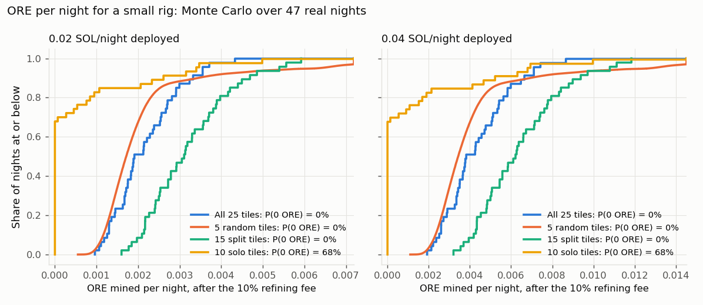
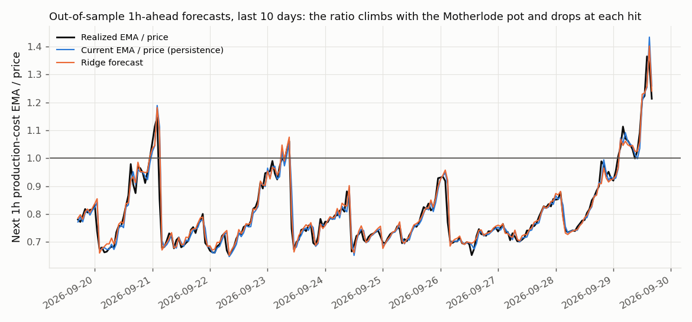

# Mine or buy for a small nightly budget: results

**Data:** every ORE round from 2026-08-11 23:38 to 2026-09-29 17:58 UTC. That is 58,801 on-chain `ResetEvent`s from rounds 363,816 to 422,634, with 18 rounds missing from the API in 8 gaps. ORE's price in SOL comes from the Orca ORE/SOL pool's hourly candles.

**Backtest:** 47 complete nights, **2026-08-13 to 2026-09-29**, with shifts from 23:00 to 07:00 WAT. That is 18,928 in-shift rounds, a median of **378 rounds per night**. All of it falls in the regime that began on Aug 12, when ORE stopped paying out parimutuel-style.

**Reproduce:** `fetch.py`, `validate.py`, `backtest.py`, `forecast.py` (see [README](README.md)). The raw outputs are in `out/*.json`; this file quotes them.

## TL;DR

1. **At 0.02 to 0.05 SOL per night spread over every round, mining is much more expensive than buying.** Always mining costs **+90% / +45% / +36%** more SOL per ORE than always buying at 0.02 / 0.04 / 0.05 SOL per night. The 95% confidence intervals (CIs) are tight: [+88, +94], [+43, +48] and [+34, +39]. On an expected-value basis, always mining did not beat buying on a single one of the 47 nights. The cause is the fixed crank fee of 5,000 lamports per round. At 0.04 SOL per night, the rig deploys about 106k lamports per round. ORE's own fees take about 11k of that, and the crank fee adds another 5k on top.
2. **"Gate, then buy the rest" ties "always buy" at these budgets. It does not beat it.** Every calibrated gate (current-EMA, Motherlode-aware, hourly, arm-time, forecast, even the hindsight oracle) stays closed on every round, so it buys everything. That still makes it 27 to 48% cheaper than always mining. The naive ORE-native gate (`production_cost_ema < price`) is dangerous at this size. It opens on 89% of rounds and costs +30 to +71% more than buying.
3. **The same budget does beat buying when it goes out in fewer, bigger deploys.** In this design the rig still heartbeats every round. It digs 0.001 SOL on the 15 split tiles, but only in rounds where the Motherlode-aware rule opens, until the night's budget is used. Whatever is left buys ORE at clock-out. The result is **−3.0% / −2.4% / −1.4%** against always buying at 0.02 / 0.04 / 0.05 SOL per night when the ORE is claimed nightly; all three CIs exclude zero. Keeping the ORE unrefined brings that to **−2.9 to −5.5%**. This is the configuration to ship. It is a modest edge, and the app should describe it as modest.
4. **Variance:** if the rig deploys on all 25 tiles, the 15 split tiles, or 5 random tiles, **P(zero-ORE night) = 0%** at both 0.02 and 0.04 SOL. Playing only the 10 solo tiles makes it **68%**. Deploying on the **15 split tiles** gives the same expected ORE with a coefficient of variation of **0.32 instead of 9.6**. Split tiles are also about 2% less crowded than solo tiles.
5. **The forecaster does not beat the simple rule, so it is demoted to advisory.** One hour ahead, ridge regression does have real skill: its mean absolute error (MAE) is 9.2% lower than persistence (95% CI of the MAE difference [−0.0035, −0.0012]). Eight hours ahead, it has none. As a gate, it beats the *hourly* current-EMA gate by 0.23% [−0.42, −0.05]. It does **not** beat the live per-round Motherlode-aware rule the program can run on-chain: the difference is +0.03% [−0.13, +0.18] at 0.36 SOL per night and +0.13% [−0.09, +0.32] at 1 SOL per night. At the target budgets it changes nothing, because no gate ever opens.

## 1. The reconstruction is exact

Every number below is replayed from raw rounds, so the replay was checked first (`validate.py`, `out/validation.json`).

| Check | Result |
|---|---|
| Admin fee = 1% per tile, on 57,718 rounds since Aug 13 | 100% of rounds (within 25 lamports of per-tile flooring) |
| Protocol fee = 10% of the SOL on the 24 losing tiles, after the admin fee | 100% of rounds (within 0.1%) |
| Minted per round = 1 ORE + 0.2 ORE into the Motherlode pot | 100% of rounds |
| Last round still on the old (parimutuel) rules | 2026-08-12 22:55 UTC (so the backtest starts Aug 13) |
| Motherlode pot = 0.2 ORE × rounds since the last hit, checked against every payout | 127 hits, **max error 0 ORE**. Mean payout 94.5 ORE. Hit rate 0.216% (theory: 0.2%) |
| Replayed `production_cost_ema` vs api.ore.com `/stats/history` (USD converted at the pool's SOL/USD) | Median ratio **0.9998** over 167 snapshots (P5 to P95: 0.994 to 1.005) |
| Replayed EMA and pot vs the **live Board and Treasury accounts** over RPC | **0-lamport difference** at two snapshots (rounds 422,615 and 422,635) |
| api.ore.com production cost below price, Sep 22 to 29 | 149 of 167 snapshots (the earlier research said 150 of 167, on a window one hour different) |

## 2. Why "production cost below price" does not make mining cheap for a small rig

`production_cost_ema` is the **protocol fee** per 1.2 ORE minted (`reset.rs`). A small rig that claims each morning pays more than that. Here is the cost stack at 0.04 SOL per night (A = 105,820 lamports per round), in effective SOL per ORE:

| Layer | SOL per ORE | vs buying |
|---|---|---|
| Protocol production cost (what the EMA and api.ore.com report) | 0.572 | |
| + 1% admin fee (true cost for the average miner) | 0.632 | |
| Small rig, no crank fee, ORE kept unrefined | 0.610 | −9.7% |
| + 10% refining fee when claimed | 0.677 | +0.3% |
| + Heads Down crank fee of 5,000 lamports per round | **0.982** | **+45.4%** |
| Buying at market (clock-out candle + 50 bps) | 0.675 | 0 |

The EMA sat below the market price on 88.9% of in-shift rounds. Even so, a claiming rig with *no* crank fee only breaks even. The fixed crank fee then dominates at small deposits. Sensitivity of always-mine vs buying at 0.04 SOL per night: crank fee 0 → **+0.3%**, 2,000 → **+18.3%**, 5,000 → **+45.4%**, 7,000 (ORE's own executor fee) → **+63.4%**.

### Crowding follows the Motherlode pot

The protocol EMA assumes 1.2 ORE per round, but the real expected value is 1 + pot/500. Miners pile in when the pot is large: the correlation between SOL deployed and pot size is **0.71**. So an EMA-only gate systematically **skips the rounds where the pot makes mining cheapest**:

| Pot (ORE) | Rounds | Avg SOL deployed | EMA (SOL/ORE) | Pot-adjusted cost = EMA × 1.2 / (1 + pot/500) |
|---|---|---|---|---|
| 0 to 25 | 13,220 | 6.36 | 0.516 | 0.604 |
| 25 to 50 | 10,318 | 6.53 | 0.514 | 0.574 |
| 50 to 100 | 12,680 | 6.82 | 0.537 | 0.563 |
| 100 to 150 | 7,457 | 7.29 | 0.574 | 0.553 |
| 150 to 200 | 4,876 | 7.74 | 0.608 | **0.542** |
| 200 to 300 | 5,874 | 8.88 | 0.698 | 0.563 |
| 300+ | 3,293 | 11.28 | 0.889 | 0.608 |

The real cost curve is U-shaped in pot size. It is cheapest at a pot of about 100 to 200 ORE. At very large pots, the crowd overshoots.

## 3. Strategy comparison

**Method:** every strategy spends the same SOL each night. Each round is a slot worth `c = 0.10504·A + crank_fee`, the expected fee on the deposit plus the crank fee. A mined slot pays the real fee on A and earns the real pro-rata ORE: `A/(winning-tile total + A)`, applied to 1 ORE plus the Motherlode payout. A bought slot spends `c` on ORE at the morning clock-out price plus 50 bps. So effective SOL per ORE = ΣSOL / ΣORE compares strategies directly.

Motherlode triggers (`rng % 500`, independent of any deployment) are integrated out as pot/500 per round. That gives an unbiased, low-variance estimate. The realized-hits column shows what actually happened.

The CIs come from a 2,000-draw night bootstrap. Gates see only deploy-time state: the live `ema_before`, the live pot, and the last *closed* price candle. A test proves that rewriting every later round and candle leaves earlier decisions unchanged.

**Budget = SOL deployed per night:** the per-shift cap funded into the user's ORE Automation, with no reload. It is spread evenly over the median 378 rounds. Claimed nightly.

| Strategy | 0.02 SOL/night (A = 52.9k lamports) | 0.04 SOL/night (A = 105.8k) | 0.05 SOL/night (A = 132.3k) |
|---|---|---|---|
| **Always buy** | 0.6754 SOL/ORE | 0.6752 | 0.6751 |
| **Always mine** (all 25 tiles, every round) | 1.2867, **+90.5%** [+87.6, +93.8]; realized +92.4% | 0.9817, **+45.4%** [+43.2, +47.9]; realized +46.9% | 0.9206, **+36.4%** [+34.3, +38.8]; realized +37.8% |
| Naive ORE-native gate: EMA < price (mines 89% of rounds) | +71.1% [+59.8, +81.9] | +37.0% [+32.0, +41.7] | +29.8% [+25.9, +33.5] |
| Current-EMA gate, calibrated to the rig's all-in cost | 0.0% (never opens) | 0.0% | 0.0% |
| Motherlode-aware gate: live per round / hourly / arm-time | 0.0% (never opens) | 0.0% | 0.0% |
| Hourly hindsight oracle (upper bound for hourly gating) | 0.0% (never opens) | 0.0% | 0.0% |
| **Same budget in 0.001 SOL deploys, split tiles, Motherlode-aware gate** | **−3.0%** [−4.9, −1.0]; 13 digs/night | **−2.4%** [−3.9, −0.8]; 23 digs/night | **−1.4%** [−2.7, −0.2]; 26 digs/night |
| Same budget, 0.001 SOL deploys, ungated (every k-th round) | +1.3% [−1.5, +4.5] | +3.7% [+1.1, +6.7] | +2.6% [+0.3, +5.1] |
| 0.001 SOL gated deploys, ORE kept unrefined | −2.9% [−6.3, +0.6] | −3.6% [−6.6, −0.2] | −4.3% [−7.1, −1.2] |
| 0.002 SOL gated deploys, ORE kept unrefined | −5.5% [−9.6, −1.1] | −5.5% [−9.3, −1.3] | −4.7% [−8.2, −0.6] |

SOL spent per night was 0.0043, 0.0065 and 0.0076 at the three budgets. The ORE that bought was 0.0063, 0.0096 and 0.0113, against 0.0033, 0.0066 and 0.0083 mined by always-mine. "Kept unrefined" skips the 10% claim fee and does **not** credit the refining share that unclaimed ORE collects, so it understates that option.

**Where mining starts to pay, spread over all 378 rounds** (effective price / always buy, claimed unless noted; from `sweep` in `out/backtest_results.json`):

| SOL/night deployed | 0.1 | 0.2 | 0.36 | 0.5 | 1 | 2 | 5 |
|---|---|---|---|---|---|---|---|
| Always mine (claim) | 1.183 | 1.093 | 1.053 | 1.039 | 1.021 | 1.013 | 1.008 |
| Always mine (unrefined) | 1.065 | 0.984 | 0.948 | 0.935 | 0.919 | 0.911 | 0.908 |
| Motherlode-aware gate (claim) | 1.000 | 0.999 | 0.997 | 0.996 | 0.991 | 0.988 | 0.986 |
| Motherlode-aware gate, arm-time price (on-chain form) | 1.000 | 1.000 | 0.999 | 0.997 | 0.992 | 0.988 | 0.986 |
| Hourly hindsight oracle | 1.000 | 0.999 | 0.995 | 0.993 | 0.988 | 0.984 | 0.982 |
| Current-EMA gate, no pot term (claim) | 1.010 | 1.026 | 1.019 | 1.014 | 1.006 | 1.001 | 0.998 |

A claiming miner never beats buying by more than about 1.5%, however much it deploys. The EMA-only gate is *worse than buying* between 0.1 and 2 SOL per night, for the crowding reason in §2.

## 4. Variance of a small rig

Always mining, net of the 10% refining fee. The Monte Carlo runs 4,000 draws per night over the 47 real nights. The draws cover the solo-tile lottery and random tile choice; the winning tile, its real total, split or solo, and the real Motherlode hits all come from the chain.

| Budget | Tiles | Mean ORE/night | P5 | Median | P95 | P(zero-ORE night) | P(< ½ mean) |
|---|---|---|---|---|---|---|---|
| 0.02 | all 25 | 0.00328 | 0.00111 | 0.00191 | 0.00355 | **0%** | 26% |
| 0.02 | 15 split | 0.00322 | 0.00185 | 0.00311 | 0.00540 | **0%** | 2% |
| 0.02 | 10 solo | 0.00336 | 0 | 0 | 0.00340 | **68%** | 85% |
| 0.02 | 5 random | 0.00328 | 0.00105 | 0.00171 | 0.00633 | **0%** | 45% |
| 0.04 | all 25 | 0.00655 | 0.00222 | 0.00382 | 0.00711 | **0%** | 25% |
| 0.04 | 15 split | 0.00644 | 0.00369 | 0.00622 | 0.01079 | **0%** | 2% |
| 0.04 | 10 solo | 0.00672 | 0 | 0 | 0.00680 | **68%** | 85% |
| 0.04 | 5 random | 0.00655 | 0.00210 | 0.00343 | 0.01277 | **0%** | 44% |

- On all 25 tiles, the gap between mean and median is the solo-tile lottery. A small rig has roughly a 0.1 to 0.2% chance per night of taking a whole ORE. That lifts the mean, but nobody experiences it. **15 split tiles** give almost the same mean with a CV of 0.32 against 9.6. Split tiles are also slightly less crowded than average (winning-tile total 0.993× the uniform share, against 1.011× for solo tiles).
- **53%** of 8-hour nights contain a Motherlode hit. For an all-25 or split rig, that hit is most of the difference between a P25 night and a P75 night.
- For the recommended concentrated rig (0.001 SOL on split tiles, gated, claimed), the Motherlode-aware rule stays closed all night on **30%** of nights. Those nights mine nothing and buy everything. It digs on average 13 rounds per night at 0.02 SOL and 23 at 0.04, out of a budget-capped maximum of 20 and 40. Across all nights at 0.04 SOL, the P5/median/P95 of ORE mined is 0 / 0.0040 / 0.0072, plus the ORE bought. When kept unrefined, it mines every night: P5 0.0036, median 0.0057, P95 0.0077 ORE.

## 5. The forecaster vs the current-EMA gate

**Setup:** walk-forward from Aug 20 to Sep 29. The window expands, the model refits daily after a 7-day warm-up, and there are 976 hourly forecasts. The target is log(mean EMA / mean price) over the next H hours. Models predict the change from persistence (`current EMA / current price`). See [MODEL_CARD.md](MODEL_CARD.md).

| Horizon | Model | MAE (log) | Skill vs persistence | 95% CI of MAE difference | Sign accuracy of "EMA < price" |
|---|---|---|---|---|---|
| 1h | persistence | 0.0259 | | | 97.1% |
| 1h | ridge | **0.0235** | **+9.2%** | [−0.0035, −0.0012] | 98.0% |
| 1h | gradient boosting | 0.0242 | +6.6% | [−0.0027, −0.0007] | 97.5% |
| 8h | persistence | 0.0735 | | | 91.6% |
| 8h | ridge | 0.0740 | −0.6% | [−0.0071, +0.0080] | 91.3% |
| 8h | gradient boosting | 0.0765 | −4.0% | [−0.0052, +0.0110] | 90.8% |

As a gate, this was tested on 40 out-of-sample nights with the same spend-matched accounting. Each figure is a paired night bootstrap of the forecast gate (ridge, Motherlode-aware, hourly) against the rule named:

| Budget (flat) | vs always buy | vs hourly current-EMA gate | vs **live per-round rule** | vs arm-time on-chain rule |
|---|---|---|---|---|
| 0.04 SOL/night | 0.00% (no gate ever opens) | 0.00% | 0.00% | 0.00% |
| 0.36 SOL/night (A ≈ 0.00095 SOL) | −0.27% [−0.56, −0.06] | −0.23% [−0.42, −0.05] | +0.03% [−0.13, +0.18] | −0.12% [−0.32, +0.06] |
| 1 SOL/night | −0.80% [−1.49, −0.25] | −0.23% [−0.45, −0.06] | +0.13% [−0.09, +0.32] | +0.02% [−0.28, +0.30] |

**Verdict:** the forecaster finds real one-hour structure. The ratio climbs as the pot grows and collapses at each hit, and it mean-reverts. It beats a gate that reads the EMA once an hour. But the program can read the *live* EMA and pot on every dig for free, and against that the forecast adds nothing measurable. Per the plan, the **forecaster is demoted to advisory**. It can explain the night ("cheaper to mine until about 04:00"), help pick which nights to spend on, and power the morning "forecast vs realized" card. It is never on the decision path.

## 6. Recommendation for Heads Down

1. **Do not spread a 0.02 to 0.05 SOL budget across every round.** At a 5,000-lamport crank fee it pays 36 to 90% more per ORE than buying. The honest EV meter would show that every night.
2. **Ship the concentrated, gated rig.** Heartbeat every round, which keeps the trustless phone gate intact. Dig **≥ 0.001 SOL** at a time on the **15 split tiles**, only in rounds where the on-chain Motherlode-aware rule opens, up to `budget / chunk` digs per night. Then **buy the remainder at clock-out**. Measured result: 1.4 to 3.0% cheaper than always buying when claimed, 3 to 5.5% when kept unrefined. Zero-ORE nights are impossible whenever it mines, and it is 28 to 49% cheaper than always mining.
3. **The on-chain rule** (`orelib.ema_ev_lamports`, `ev_threshold_lamports`, tested). Reads only `Board.production_cost_ema` and `Treasury.motherlode`:
   `ema_ev = ema · 6 · 500 · 10^11 / (5 · (500 · 10^11 + pot))` (u128, checked), and dig iff `ema_ev < plan.max_ev_cost`.
   The phone signs `max_ev_cost = price_at_arm · (1 + buy_cost) · 0.09504 / k`, where `k = (0.10504·A + crank_fee) / (A · (1 − refining))`, and it can only ever tighten the wallet's cap. Freezing the price at arm time cost 0 to 0.15% against live price updates in this data.
   **Do not** use ORE's `max_production_cost = price` alone as the gate. That configuration mines 89% of rounds and loses 30 to 71% at these budgets. If it is set as the outer guardrail, use about 0.78 × price for a 0.001 SOL deploy.
4. **Make "keep unrefined" the default, or show the 10% refining fee plainly.** It swings the result by about 10 points.
5. **Push the crank fee down by batching rigs per transaction.** Every 1,000 lamports per round is worth about 9 percentage points at 0.04 SOL per night flat, and about 1 point with 0.001 SOL deploys.
6. **Foreman Cost Forecaster:** advisory only (see the model card). Revisit when there is more than 60 days of data, or if the rig ever has to commit a plan hours ahead without per-round on-chain reads.

## Limits

- **Coverage:** 47 nights in a single fee regime. ORE changes parameters often (Reserve share, round length, split and solo rules). The fetcher archives `/stats/history` on each run so later reruns get longer history.
- **Prices:** hourly candles from one pool (Orca ORE/SOL). The buy leg is filled at the open of the clock-out hour, plus a flat 50 bps. Price impact is ignored, which is fine for buys under 0.01 SOL.
- **Other miners are held fixed.** 1,000 Heads Down rigs digging 0.001 SOL in the same round would add 1 SOL, which is 9 to 17% of the usual 6 to 11 SOL. That would raise crowding measurably, so re-run the backtest with `--crank-fee` and a crowd uplift before scaling.
- **Shares:** the winning tile's real total (`deployed_winning_square`) gives the exact share for the all-25 rig. Split, solo and random tile sets rely on the winning tile being a uniform draw, which is true by construction of `rng % 25`. The real totals of the losing tiles are not in the API; they only affect the loss rate, which is fixed at 10.9% of the deposit.
- **Refining share:** the "kept unrefined" rows skip the claim fee but do not credit the refining share (the Treasury showed about 90.8k ORE unrefined at snapshot time). That makes this option conservative.
- **Gaps:** 18 missing rounds in 8 gaps. The replay still matches the live Board to the lamport afterwards, because the EMA forgets within about 100 rounds.
